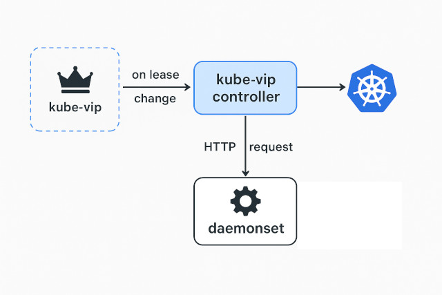

# Kube-vip controller
This is a kube-vip controller that listens for changes in the kube-vip lease.
When it receives an event from the API server indicating that the lease has changed, it sends an HTTP request to a DaemonSet/Service.
This controller can be used for any cloud network.

Use case:
- In Hetzner Cloud (hcloud), when a private network IP changes, the cloud requires sending a request to set an alias IP via the hcloud API.
- In Headscale, when the advertised route changes, it must be updated in the Headscale server.

This is only the kube-vip controller. 

This controller run in 2 mode. 
1. **DaemonSet** - When lease change can find DaemonSet on lease node or send simple request  
2. **Service** - When lease change send http request (can add as sidecar in helm cahrt)

Use this controller as a strategy to send notifications to your cloud provider whenever you want when detect a kube-vip lease change.




# Features
- Controller listen for change Leader of kube-vip (Lease).
- If lease has changed, try to find daemonset running in new lease (node).
- If not find daemonset on that node will try every 5s to find daemonset until lease change again.
- If daemonset http server do not return code 200 will try until lease change every 2s.

# Parameters
```
Options:
  -daemonset_name string
        Deamonset name for find to send webhook when lease change (default "kube-vip-cp-change-lease")
  -daemonset_path string
        When holder change, controller will find daemonset on that node and send POST request to that path (default "/leader")
  -daemonset_port string
        When holder change, controller will find daemonset on that node and send POST request to that port (default "8080")
  -endpoint string
        HTTP server endpoint for health and return info with actual lease name (default "0.0.0.0:8080")
  -h    Show help
  -https
        Send request to daemonset with https
  -lease string
        Lease name for kube vip (default "plndr-cp-lock")
  -namespace string
        Namespace where DaemonSet are installed (default "kube-system")
  -service_host string
        If you not want to search Daemonset and simple send request to service. Set service host (default "")
```

# Install

```sh
docker run -it --rm ghcr.io/gawsoftpl/kube-vip-controller
```

```sh
helm repo add kube-vip-controller https://gawsoftpl.github.io/kube-vip-controller
helm repo update
helm upgrade --install kube-vip-controller kube-vip-controller/kube-vip-controller
```

# Development
Use `mirrord` for inject local dev code to cluster.

```sh
make build
```

or build and load to cluster
```sh
make docker
kind load docker-image kube-vip-controller --name kube-vip-webhook
```

## Create test cluster
```sh
# Create cluster kind
make cluster
INTERFACE=`docker network inspect kind -f '{{ range $i, $a := .IPAM.Config }}{{ println .Subnet }}{{ end }}'`

# Install kube-vip
alias kube-vip="docker run --network host --rm ghcr.io/kube-vip/kube-vip:v1.0.0"
kubectl apply -f https://kube-vip.io/manifests/rbac.yaml 
kube-vip manifest daemonset \
    --address 172.18.0.100 \
    --services \
    --controlplane \
    --enableLoadBalancer \
    --taint \
    --leaderElection \
    --inCluster \
    --arp \
    --interface eth0 | kubectl apply -f -

# Create k8s manifest
make k8s-manifest

```
